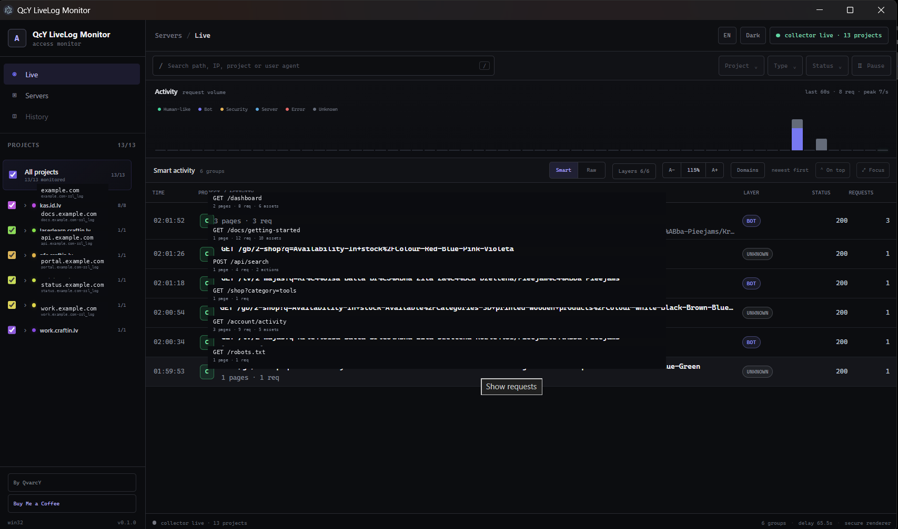

<div align="center">

# QcY LiveLog Monitor

**Reāllaika SSH piekļuves žurnālu uzraudzība bez papildu aģenta instalēšanas serverī.**

Pārvērt trokšņainu Apache/Nginx access log plūsmu meklējamos pieprasījumos, grupētā Smart aktivitātē un pārskatāmā projektu uzraudzībā.

[English](README.md) · [Ceļvedis](docs/ROADMAP.md) · [Drošība](SECURITY.md) · [Ieguldījumi](CONTRIBUTING.md)


</div>

---

> **Pašreizējais Windows izpildījums:** QcY LiveLog Monitor v1.0.0 šobrīd ir pieejams kā Windows `.exe` programma. Nākotnē paredzēts piedāvāt arī otru izplatīšanas variantu, kas neizmanto `.exe` palaišanas failu.



## Kas ir QcY LiveLog Monitor?

QcY LiveLog Monitor ir viegla darbvirsmas programma web serveru piekļuves žurnālu uzraudzībai caur SSH.

Programma izmanto esošu SSH kontu un privāto atslēgu, atrod konfigurācijai atbilstošos log failus, seko tiem reāllaikā un parāda trafiku divos skatos:

- **Smart** — saistīti pieprasījumi tiek grupēti saprotamā aktivitātē.
- **Raw** — katrs parsētais pieprasījums paliek pieejams atsevišķai apskatei.

Uz attālinātā servera nav jāinstalē QcY aģents.

## Galvenās iespējas

| Funkcija | Ko tā dara |
| --- | --- |
| Vairāku projektu atklāšana | Atrod atbilstošos access log failus un parāda projektus izvēlamā kokā |
| Smart aktivitāte | Grupē lapas, resursus un fona darbības vienā saprotamā aktivitātē |
| Raw skats | Parāda katru pieprasījumu atsevišķi |
| Live Search | Meklē pēc projekta, ceļa, IP, metodes, statusa, User-Agent u.c. |
| Meklēšanas ieteikumi | Ieteikumi tiek veidoti no pašreizējās dzīvajās sesijas datiem |
| Project / Type / Status filtri | Filtrus var kombinēt ar Search |
| Pause / Resume | Aptur ekrāna atjaunošanu, neapturot SSH collector |
| Aktivitātes grafiks | Pēdējo 60 sekunžu trafika pārskats |
| Event details | Detalizēts Raw vai Smart notikuma panelis pēc pieprasījuma |
| Droša paroļu glabāšana | Atcerētā SSH passphrase izmanto Electron `safeStorage` |
| Projektu atlase | Var ieslēgt vai izslēgt atsevišķus log avotus |
| Dark / Light | Iebūvētas abas tēmas |
| Latviešu / English | Pilna lietotnes saskarne abās valodās |
| Focus / Always on top | Ērti darbam līdzās izstrādes un administrēšanas rīkiem |

## Kā tas darbojas?

QcY izveido SSH savienojumu ar izvēlēto servera profilu un attālināti seko konfigurācijai atbilstošajiem access log failiem.

```text
SSH serveris
   │
   ├─ access.log / *-ssl_log / pielāgots patterns
   │
   ▼
QcY live collector
   │
   ├─ parsē pieprasījumu
   ├─ klasificē trafiku
   ├─ aprēķina novēroto log aizturi
   └─ grupē saistītu aktivitāti
        │
        ├─ Smart skats
        └─ Raw skats
```

QcY darbībai nav nepieciešams QcY mākoņkonts.

## Prasības

Ikdienas lietošanai:

- Windows 10 vai Windows 11;
- SSH pieeja serverim;
- SSH privātā atslēga;
- lasīšanas tiesības attālinātajai logu mapei;
- Apache/Nginx combined tipa access log vai savietojams formāts.

Izstrādei no pirmkoda:

- Git;
- aktuāla Node.js versija;
- npm.

## Instalēšana

### GitHub Release

Ikdienas lietošanai lejupielādē jaunāko Windows laidienu no GitHub **Releases** sadaļas.

Publiskajai release pakotnei nebūs nepieciešams atsevišķi instalēt Node.js.

### No pirmkoda

```powershell
git clone https://github.com/QvarcY/qcy-livelog-monitor.git
cd qcy-livelog-monitor
npm ci
npm run desktop
```

Izstrādes pārbaudes:

```powershell
npm run typecheck
npm run build

node .\scripts\test-activity-grouping.mjs
node .\scripts\test-smart-activity.mjs
node .\scripts\test-project-monitoring.mjs
```

## Pirmā servera konfigurēšana

Atver **Serveri** un izveido servera profilu.


Tipiski lauki:

| Lauks | Piemērs |
| --- | --- |
| Nosaukums | `Production server` |
| Hosts | `example.com` |
| SSH ports | `22` |
| SSH lietotājs | `deploy` |
| Privātā atslēga | `C:\Users\you\.ssh\id_ed25519` |
| Logu mape | `/var/log/nginx` |
| Logu patterns | `*.log` |
| Loga sufikss | pēc izvēles |

QcY atbalsta pielāgotu SSH portu un jebkuru pieejamu attālināto logu direktoriju.

Pēc savienojuma testa saglabā profilu.

Ja ieslēgts **Droši atcerēties paroli**, šifrētais noslēpums tiek glabāts ar Electron `safeStorage`. Passphrase netiek ierakstīta servera profila JSON failā.

## Projektu izvēle

Pēc logu atklāšanas kreisajā pusē tiek parādīti pieejamie projekti.

Var:

- ieslēgt vai izslēgt atsevišķu projektu;
- ieslēgt vai izslēgt visu grupu;
- ieslēgt vai izslēgt visus projektus;
- sakļaut lielas grupas;
- monitorēt tikai vajadzīgos log avotus.

Izslēgts projekts netiek `tail`-ots aktīvajā collector sesijā.

## Smart un Raw

### Smart

Smart skats samazina access log troksni.

Viena lapas ielāde var radīt dokumenta pieprasījumu, attēlus, CSS, JavaScript un fona API izsaukumus. QcY mēģina tos apvienot vienā saprotamā aktivitātē.

Smart slāņi:

- **Human-like**
- **Bot**
- **Security**
- **Server**
- **Error**
- **Unknown**

`Human-like` ir heiristisks apzīmējums. Tas nav pierādījums, ka pieprasījumu izdarīja reāls cilvēks.

Esošs bot vai security signāls ir prioritārāks par human-like heiristiku.

### Raw

Raw skatā katrs parsētais pieprasījums ir redzams atsevišķi.

Tas ir noderīgs, ja vajag precīzus request datus:

- metodi un ceļu;
- HTTP statusu;
- IP;
- protokolu;
- baitus;
- referrer;
- User-Agent;
- servera laiku;
- saņemšanas laiku;
- novēroto hostinga/log aizturi.

## Search un filtri

Search strādā gan Smart, gan Raw skatā.

Var meklēt, piemēram:

```text
/knowledge
example.com
192.0.2.25
Googlebot
POST
404
Chrome/
```

Fokusējot meklēšanas lauku, QcY piedāvā pašreizējā sesijā atrastas vērtības.

Search var kombinēt ar:

- **Project**
- **Type**
- **Status**

Filtru vērtības tiek ģenerētas no datiem, kas patiešām ir pašreizējā sesijā.

## Pause / Resume

**Pause** iesaldē tabulas un aktivitātes grafika attēlošanu.

SSH collectors turpina saņemt datus fonā.

Pēc **Resume** visi pauzes laikā uzkrātie notikumi tiek attēloti.

Tas ļauj mierīgi apskatīt aktīvu log plūsmu, nezaudējot jaunus requestus.

## Event details

Noklikšķini uz Smart aktivitātes vai Raw pieprasījuma, lai atvērtu detalizētu paneli.

Raw pieprasījumam var redzēt:

- projektu;
- tipu;
- statusu;
- IP;
- protokolu;
- baitus;
- servera laiku;
- saņemšanas laiku;
- aizturi;
- referrer;
- User-Agent.

Smart aktivitātei papildus redzama grupas struktūra un tajā iekļautie requesti.

## Aktivitātes grafiks

Grafiks rāda pēdējās 60 sekundes.

Stabiņa augstums atspoguļo trafika apjomu, bet Smart slāņu krāsas palīdz atšķirt human-like, bot, security, server, error un unknown aktivitāti.

Klikšķis uz konkrētas sekundes ieslēdz pagaidu laika filtru.

## Drošības modelis

QcY primāri paredzēts SSH atslēgu autentifikācijai.

Svarīgākās īpašības:

- privātā SSH atslēga paliek lokālajā datorā;
- QcY neglabā SSH passphrase vienkāršā tekstā;
- atcerētā passphrase izmanto Electron `safeStorage`;
- bojāta credential glabātuve netiek klusi aizstāta ar tukšu;
- credential fails vispirms tiek ierakstīts pagaidu failā;
- collectors pārbauda SSH servera host key;
- DEV Electron netiek reģistrēts Windows autostartā.

Par drošības problēmu ziņošanu skaties [SECURITY.md](SECURITY.md).

## Privātums

QcY darbojas lokāli un savienojas tieši ar lietotāja norādīto SSH serveri.

QcY konts vai QcY mākoņserviss nav nepieciešams.

Access log var saturēt IP adreses, URL ceļus, referrer un User-Agent informāciju. Pirms publiski kopīgot screenshotus vai diagnostiku, tie jāuzskata par potenciāli sensitīviem datiem.

## Atbalstītie log formāti

Pašreizējais parsētājs paredz combined tipa HTTP access log ar:

```text
IP
timestamp
"METHOD PATH HTTP/x"
status
bytes
referrer
User-Agent
```

Apache combined logi ir atbalstīti.

Nginx darbojas, ja tā access log formāts ir savietojams ar combined struktūru.

## Zināmie v1.0 ierobežojumi

- vienlaikus aktīvs ir viens SSH servera profils;
- vienlaicīga vairāku serveru monitorēšana vēl nav ieviesta;
- Smart aktivitāte ir heiristiska;
- logu aizture ir atkarīga no konkrētā servera/hostinga;
- ilgtermiņa aktivitāšu vēsture vēl netiek glabāta;
- projektu grupēšana vēl neizmanto pilnu Public Suffix List.

Tie ir kandidāti nākamajiem laidieniem, nevis v1.0 bloķējošas problēmas.

## Problēmu risināšana

### QcY pieslēdzas, bet pieprasījumi neparādās

Pārbaudi:

1. vai projekts ir ieslēgts;
2. vai attālinātais loga ceļš ir pareizs;
3. vai SSH lietotājam ir lasīšanas tiesības;
4. vai vietne patiešām raksta šajā log failā;
5. vai hostings nebuferē logus ar lielu aizturi.

Dažās hostinga vidēs access log ieraksti var parādīties ar ievērojamu aizturi.

### Domēns tiek atrasts, bet dzīvs trafiks neparādās

Atrasts log fails var būt novecojis vai vietne var būt pārcelta uz citu serveri.

QcY v1.0 atrod pieejamos log avotus, bet vēl neveic ilgtermiņa stale-source analīzi.

### Smart klasifikācija šķiet nepareiza

Smart klasifikācija ir apzināti heiristiska.

Ja vajag request līmeņa patiesību, izmanto **Raw**.

### SSH passphrase tiek prasīta atkārtoti

Pārbaudi, vai servera profilā bija ieslēgta drošā passphrase atcerēšanās un vai operētājsistēmas credential šifrēšana joprojām ir pieejama.

## Izstrāde

Noderīgākās komandas:

```powershell
npm run typecheck
npm run build
npm run desktop
```

Regresiju testi:

```powershell
node .\scripts\test-activity-grouping.mjs
node .\scripts\test-smart-activity.mjs
node .\scripts\test-project-monitoring.mjs
```

Pirms pull request ieteicams izpildīt visas pārbaudes.

## Ceļvedis

Publiskais attīstības plāns atrodas [docs/ROADMAP.md](docs/ROADMAP.md).

Plānotie virzieni:

- vairāku serveru vienlaicīga monitorēšana;
- noturīga aktivitāšu vēsture;
- stale/dormant log avotu noteikšana;
- uzlabota domēnu grupēšana;
- papildu log formāti;
- release un iepakošanas uzlabojumi.

## Ieguldījumi projektā

Ieguldījumi ir gaidīti.

Pirms pull request izlasi [CONTRIBUTING.md](CONTRIBUTING.md).

Drošības problēmas jāziņo pēc [SECURITY.md](SECURITY.md) aprakstītās kārtības, nevis publiskā issue.

## Licence

QcY LiveLog Monitor publicēts ar [MIT licenci](LICENSE).

## Autors

**QvarcY**

GitHub: https://github.com/QvarcY

Ja QcY ietaupa laiku un vēlies atbalstīt turpmāko izstrādi:

**Buy Me a Coffee:** https://buymeacoffee.com/craftin