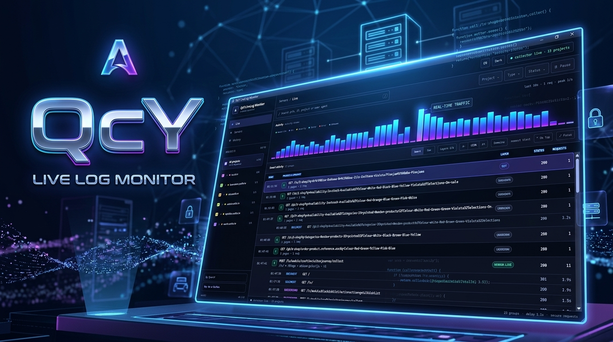
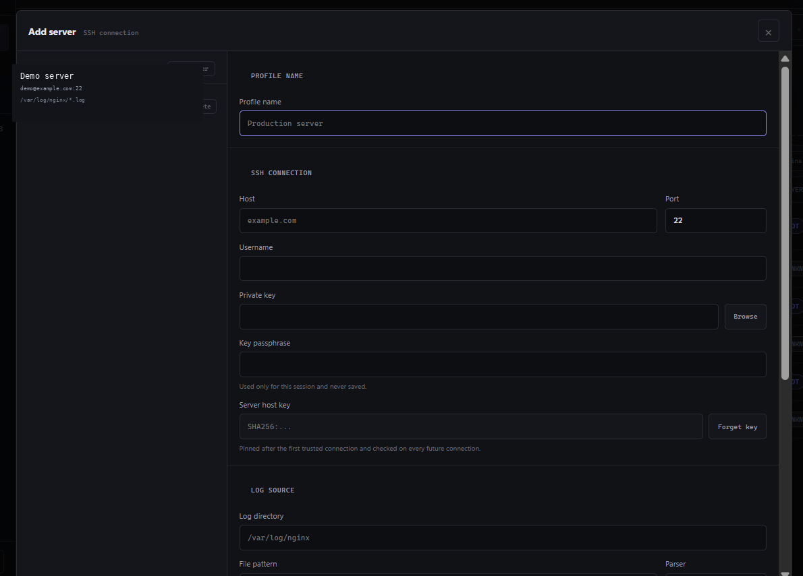

<div align="center">

# QcY LiveLog Monitor

**Real-time SSH access-log monitoring without installing an agent on the server.**

Turn noisy Apache/Nginx access logs into searchable requests, grouped Smart activity, project-level monitoring and useful live diagnostics.

[Latviešu](README.lv.md) · [Roadmap](docs/ROADMAP.md) · [Security](SECURITY.md) · [Contributing](CONTRIBUTING.md)


</div>

---



## What is QcY LiveLog Monitor?

QcY LiveLog Monitor is a lightweight desktop application for watching web-server access logs over SSH.

It connects to a server using your existing SSH account and private key, discovers configured log files, follows them live and presents the traffic in two complementary views:

- **Smart** — related requests are grouped into meaningful activity.
- **Raw** — every parsed request remains available for direct inspection.

No monitoring agent has to be installed on the remote server.

## Highlights

| Feature | What it does |
| --- | --- |
| Multi-project discovery | Discovers matching access-log files and presents projects in a selectable tree |
| Smart activity | Groups document requests, assets and background actions into useful sessions |
| Raw request view | Shows individual requests without Smart grouping |
| Live search | Search by project, path, IP, method, status, User-Agent and more |
| Search suggestions | Suggestions are generated from the current live session |
| Project / Type / Status filters | Combine filters with search in both Smart and Raw views |
| Pause / Resume | Freeze rendering without stopping the SSH collector |
| Activity timeline | 60-second request-volume overview with Smart layer colours |
| Event details | Open an on-demand drawer with request or Smart-group metadata |
| Secure credentials | Optional remembered SSH passphrases use Electron `safeStorage` |
| Project monitoring | Enable or disable individual discovered log sources |
| Dark / Light themes | Built-in theme switching |
| English / Latvian | Full application UI in both languages |
| Focus / Always on top | Useful when QcY is kept beside development or admin tools |

## How it works

QcY uses one SSH connection to the selected server profile and follows matching access-log files remotely.

The basic flow is:

```text
SSH server
   │
   ├─ access.log / *-ssl_log / custom pattern
   │
   ▼
QcY live collector
   │
   ├─ parse request
   ├─ classify traffic
   ├─ calculate observed log delay
   └─ group related activity
        │
        ├─ Smart view
        └─ Raw view
```

The application does not require a QcY cloud account.

## Requirements

For normal use:

- Windows 10 or Windows 11
- SSH access to the server
- an SSH private key
- read access to the remote access-log directory
- Apache/Nginx-style combined access logs or a compatible format

For development from source:

- Git
- a current Node.js installation
- npm

## Installation

### GitHub release

For normal use, download the latest Windows release from the repository's **Releases** page.

The public release package will not require installing Node.js.

### From source

```powershell
git clone https://github.com/QvarcY/qcy-livelog-monitor.git
cd qcy-livelog-monitor
npm ci
npm run desktop
```

For development:

```powershell
npm run typecheck
npm run build

node .\scripts\test-activity-grouping.mjs
node .\scripts\test-smart-activity.mjs
node .\scripts\test-project-monitoring.mjs
```

## First server setup

Open **Servers** and create a server profile.



Typical values:

| Field | Example |
| --- | --- |
| Name | `Production server` |
| Host | `example.com` |
| SSH port | `22` |
| SSH user | `deploy` |
| Private key | `C:\Users\you\.ssh\id_ed25519` |
| Log directory | `/var/log/nginx` |
| Log pattern | `*.log` |
| Log suffix | optional |

QcY supports custom SSH ports and custom remote log directories.

After testing the connection, save the profile.

If **Remember passphrase securely** is enabled, the encrypted secret is stored through Electron's OS-backed `safeStorage`. The passphrase is not written into the server profile JSON.

## Selecting projects

After log discovery, QcY displays the available projects in the left sidebar.

You can:

- enable or disable an individual project;
- enable or disable a whole project group;
- enable or disable all projects;
- collapse large groups;
- keep monitoring only the log sources that matter.

Disabling a project prevents that log source from being tailed by the active collector.

## Smart vs Raw

### Smart

Smart view reduces access-log noise.

A browser page load may generate one document request, many images, CSS files, JavaScript files and background calls. QcY groups related requests so the activity is easier to read.

Smart layers include:

- **Human-like**
- **Bot**
- **Security**
- **Server**
- **Error**
- **Unknown**

`Human-like` is a heuristic label. It is not proof that a request came from a real person.

Existing bot or security evidence takes precedence over human-like heuristics.

### Raw

Raw view shows parsed requests individually.

Use it when you need exact request-level data such as:

- method and path;
- HTTP status;
- source IP;
- protocol;
- bytes;
- referrer;
- User-Agent;
- server timestamp;
- receive time;
- observed hosting/log delay.

## Search and filters

Search works in both Smart and Raw views.

You can search for values such as:

```text
/knowledge
example.com
192.0.2.25
Googlebot
POST
404
Chrome/
```

When the search field is focused, QcY suggests values found in the current session.

Search can be combined with:

- **Project**
- **Type**
- **Status**

The filters are generated dynamically from data actually present in the current session.

## Pause / Resume

**Pause** freezes the visible table and activity timeline.

The SSH collector continues receiving data in the background.

When **Resume** is selected, accumulated events are rendered immediately.

This is useful when inspecting a busy live stream without losing requests.

## Event details

Click a Smart activity or Raw request to open the Event Details drawer.

For Raw requests, QcY can show:

- project;
- request type;
- status;
- IP;
- protocol;
- byte count;
- server time;
- receive time;
- observed delay;
- referrer;
- User-Agent.

For Smart activity, QcY also shows request composition and the requests grouped into that activity.

## Activity timeline

The activity timeline represents the last 60 seconds.

Bar height represents traffic volume. Smart-layer colours make it easier to distinguish human-like, bot, security, server, error and unknown activity.

Clicking a second in the timeline applies a temporary time filter.

## Security model

QcY is designed around SSH key authentication.

Important properties:

- private keys remain on the local computer;
- SSH passphrases are never stored in plain text by QcY;
- remembered passphrases use Electron `safeStorage`;
- malformed credential storage fails closed instead of silently resetting;
- saved credential files are written through a temporary file before replacement;
- SSH host-key verification is used by the collector;
- development Electron is not registered as a Windows startup application.

See [SECURITY.md](SECURITY.md) for reporting vulnerabilities.

## Privacy

QcY operates locally and connects directly to the SSH server configured by the user.

The application does not require a QcY account or a hosted QcY backend.

Access logs may contain IP addresses, paths, referrers and User-Agent strings. Treat screenshots and exported diagnostics as potentially sensitive information before sharing them publicly.

## Supported log formats

The current parser targets combined-style HTTP access logs containing:

```text
IP
timestamp
"METHOD PATH HTTP/x"
status
bytes
referrer
User-Agent
```

Apache combined logs are supported.

Nginx logs are supported when configured in a compatible combined-style format.

## Known v1.0 limitations

- one active SSH server profile is monitored at a time;
- multi-server simultaneous monitoring is not yet available;
- Smart activity is heuristic rather than identity verification;
- log delivery delay depends on the hosting/server environment;
- historical persistent analytics are not included yet;
- project grouping is based on discovered host names rather than a full Public Suffix List implementation.

These are candidates for future releases rather than blockers for v1.0.

## Troubleshooting

### QcY connects but no requests appear

Check that:

1. the selected project is enabled;
2. the remote log path is correct;
3. the SSH user has permission to read the log;
4. the website is actually writing to that log;
5. the hosting platform does not buffer log writes for a long period.

Some hosting environments expose access-log entries with noticeable delay.

### A domain is discovered but new traffic never appears

The discovered file may be stale or the live website may now be hosted on another server.

QcY v1.0 discovers available log sources; it does not yet perform long-term stale-source analysis.

### Smart classification looks wrong

Smart classification is intentionally heuristic.

Switch to **Raw** when request-level truth is more important than grouped interpretation.

### SSH key passphrase is requested again

Check whether **Remember passphrase securely** was enabled for that server profile and whether the operating-system credential encryption remains available.

## Development

Useful commands:

```powershell
npm run typecheck
npm run build
npm run desktop
```

Regression suites:

```powershell
node .\scripts\test-activity-grouping.mjs
node .\scripts\test-smart-activity.mjs
node .\scripts\test-project-monitoring.mjs
```

Please run all checks before submitting a pull request.

## Roadmap

The public roadmap is maintained in [docs/ROADMAP.md](docs/ROADMAP.md).

Planned directions include:

- simultaneous multi-server monitoring;
- persistent activity history;
- stale/dormant log-source detection;
- improved domain grouping;
- additional log-format support;
- release and packaging improvements.

## Contributing

Contributions are welcome.

Please read [CONTRIBUTING.md](CONTRIBUTING.md) before opening a pull request.

For security problems, use the process described in [SECURITY.md](SECURITY.md) instead of opening a public vulnerability issue.

## License

QcY LiveLog Monitor is released under the [MIT License](LICENSE).

## Author

**QvarcY**

GitHub: https://github.com/QvarcY

If QcY saves you time, you can support further development:

**Buy Me a Coffee:** https://buymeacoffee.com/craftin